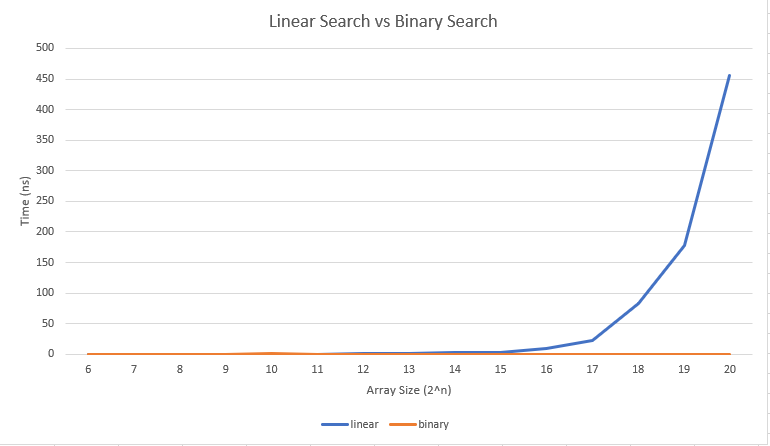

# Linear vs Binary search

Just a small test for when linear search is faster.

## Usage

Compilation:
`gcc -O3 searching.c -o search -lm`

Running:
First, run `ulimit` in order to allow the program to use unlimited memory.
`./search 20`

## Results

Linear search is trivially faster on my computer on arrays up to size 2^10. After that, binary search is much faster.

For reference, my computer has 16 GB of ram and an 8 core i7-7700HQ @ 2.8GHz (laptop processor)

### Data

size | linear | binary
-----|--------|-------
0 | 0.033333 | 0.033333
1 | 0.033333 | 0.033333
2 | 0.033333 | 0.033333
3 | 0.033333 | 0.033333
4 | 0.033333 | 0.033333
5 | 0.033333 | 0.033333
6 | 0.033333 | 0.033333
7 | 0.033333 | 0.033333
8 | 0.033333 | 0.033333
9 | 0.033333 | 0.033333
10 | 0.133333 | 0.733333
11 | 0.3 | 0.033333
12 | 0.5 | 0.033333
13 | 1.633333 | 0.066667
14 | 2.233333 | 0.066667
15 | 3.733333 | 0.033333
16 | 9.166667 | 0.066667
17 | 22.4 | 0.066667
18 | 82.333333 | 0.1
19 | 178.266667 | 0.166667
20 | 456.033333 | 0.066667
